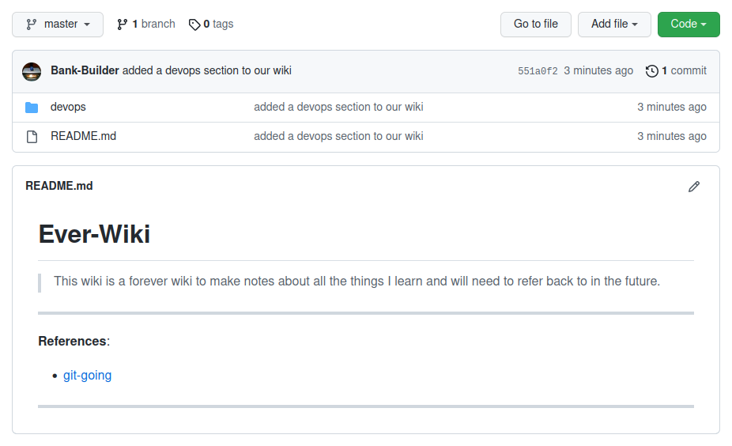

# GIT basics

## 2005, April 7th

When [Linus Torvalds](https://en.wikipedia.org/wiki/Linus_Torvalds) made his initial commit of Git's code on April 7th 2005, he supplied the commit message:

```
Initial revision of "git", the information manager from hell
```

In this commit, he included a file called README. The first paragraph in this file reads:

```
GIT - the stupid content tracker

"git" can mean anything, depending on your mood.

 - random three-letter combination that is pronounceable, and not 
   actually used by any common UNIX command.  The fact that it is a
   mispronunciation of "get" may or may not be relevant.
 - stupid. contemptible and despicable. simple. Take your pick from the 
   dictionary of slang.
 - "global information tracker": you're in a good mood, and it actually
   works for you. Angels sing, and a light suddenly fills the room. 
 - "goddamn idiotic truckload of sh*t": when it breaks

This is a stupid (but extremely fast) directory content manager.  It  
doesn't do a whole lot, but what it _does_ do is track directory
contents efficiently.
```

## Before GIT and why GIT

Version Control Systems before `git` came along were typically centralised systems into which you checked in and checked our your code.  Over the past several decades there have been many [popular source code versioning systems](https://www.softwaretestinghelp.com/version-control-software/) and they generally fall into two types, centralised and decentralised. 

Centralised VCS tend to be client-server and are loosely based on the idea that no two developers should work on the same file at the same time.  This  requires every team to be synchronised and coordinated when *checking in* and *checking out* code.

> GIT is **decentralised**.

Since Git is decentralised, this means that the usage philosophy is completely different with `git`.  Each developer has a complete copy of the repository they are working on, on their local PC. Therefore, from time to time changes need to be merged from developers when git is used to push changes to a shared server.

Typically this shared server is [gitub](https://github.com) but it could be any git compatible shared server.

---
```Git was also created by Linus Torvalds in the process of developing Linux. Many people were involved in the development of Linux by making small or large contributions. 

After some time, it became really hard to manage and maintain all the changes and updates. That is the reason why Git was created.

Git is a version control system that maintains a history of all changes made to the code. Code changes are stored in a special database called a “repository”, also known as “repo”.

Two main advantages of using Git at software development:

    * Tracking the changes and updates. We are able to see who made which changes. 
      Git also provides when and why a change was made.
    * Allowing to work collaboratively. 
      Software development projects usually require many  people to work together.
      Git provides the developers with a systematic way of doing that.
      Thus, the developers focus on the project instead of extensive communication.

Git has become the globally preferred SCV tool because of it's:

    * fast and tiny footprint
    * scalability, 
    * free and open source
    * easy branching
    * easily trace contribution
    * implicit backup
```

---
# Getting Started

## Installing Git

> <br>[Install](https://git-scm.com/download/win) and run the **Git Bash** program if you are on Windows, and [Git Desktop](https://desktop.github.com/) if you are afraid of the terminal or <br><br>install with `sudo apt install git-all` on Linux, or <br><br>[download](https://git-scm.com/download/mac) and run the macOS installer on Mac..
<br><br>


Now, in the 'Git Bash' terminal we can confirm our installed version with `git --version`.

But before using `git` we will first setup our ssh key with which we will access github, to commit and push our files. For teh rest of these chapters we will only refer to the CLI version of `git` on our local PC and `github` as the server we use.  [Gitlab](https://gitlab.com) is a robust alternative to `github` and worth have a look at in your own time.


## Setting up ssh key(s)

> These instructions are for Ubuntu but should work in a Git Bash shell on Windows or OSX equally well. You may setup more than one ssh key if you wish for different github accounts etc


```
cd .ssh
ssh-keygen -t rsa -b 4096 -C "email@domain.co.za" -f id_student
# Don't add a password if you are want to avoid entering your password on ervy commit.

cat ~/.ssh/id_student.pub
# copy the public key so we can paste into SSH keys section in github settings

# private key part must have correct permissions
chmod 400 ~/.ssh/id_student

# list known identities
ssh-add -l

# if you key is not shown then run the ssh-agent and add your key
eval "$(ssh-agent -s)"
ssh-add id_private
```

> If you want to specify which key to use for which github account then you may utilise a `~/.ssh/config` , and some details of how to set this up may be found [here](https://www.digitalocean.com/community/tutorials/how-to-configure-custom-connection-options-for-your-ssh-client)


## Setting up git & github config 
> After registering on [Github](https://github.com) do the following on your local PC:

```
git config --global user.name "User Name"
git config --global user.email "email@domain.co.za"
git config --global color.ui auto
git config -l

# Test your github access 
ssh -T git@github.com
```

Finally, now we are ready to git-going!

### Creating our first repo locally
```
mkdir ever-wiki
cd ever-wki
```

Lets create our first file in our personal wiki with `touch README.md` and using our favourite editor we can some [markdown](https://docs.github.com/en/get-started/writing-on-github/getting-started-with-writing-and-formatting-on-github/basic-writing-and-formatting-syntax) content.
```
# Ever-Wiki

> This wiki is a forever wiki to make notes about all the things I learn and will need to refer back to in the future.

---
**References**:
* [git-going](https://github.com/cyber-mint/git-going)

---

```

### Git in action
With just a few steps we will have our first repo up and running:
* login to Github and create an empty repo called `ever-wiki` without `.gitignore` or `README` files.  Add a repo description - `A wiki of everything I am learning` for completeness.

Now locally back on our PC:
* `git init` to initialise our working directory.  This is in the root folder of your project.
* `git add .` to add all our files to the staging area.
* `git commit -m "Initial Commit"` to create our initial commit, and move out files from the staging area and store the changes permanently in our repo.
* `git remote add origin git@github.com/{git-user-name}/ever-wiki.git`
* `git push origin master`

Now, lets switch to our [http://github.com/{git-user-name}/ever-wiki]() and take a look at what we have created....

Now lets remove our project folder with `cd .. && rm -rf ever-wiki/` and see how cloning works.

* `git clone git remote add origin git@github.com:{git-user-name}/ever-wiki.git` will recreate the folder `ever-wiki/` and "clone" our repo files locally again.
* `cd ever-wiki/` and `ls -lsa` to take a look at our files - phew they are all back again!

Lets make some changes to our repo and see how staging works:
* `git status` will tell us some important things, like what branch we are on and what has changed, what might be staged etc...

Lets make some changes to our repo and see how is is reflected:
* add a folder called `devops`
* add a file called `docker.md`
* copy some content to get started

```
### Docker Cheat Sheet
Break down of the docker run command:

Example:  `docker run --rm -d -p 8080:80 --name web nginx`

And you may open the web service in your browser at `localhost:8080` to see it running.

To stop the container with SIGTERM `docker stop web`

To stop the container with SIGKILL`docker kill web`
```
* add an entry in your `README.md` file to link to the `devops/docker.md` file.

Now , lets run `git status` to see what is changed:
```
~/dev/ever-wiki$ git status
On branch master
Untracked files:
  (use "git add <file>..." to include in what will be committed)
	devops/

nothing added to commit but untracked files present (use "git add" to track)
```
Now lets stage the untracked files with `git add devops/docker.md` and check the status again:

```
~/dev/ww$ git status
On branch master
Changes to be committed:
  (use "git restore --staged <file>..." to unstage)
	new file:   devops/docker.md
```
Now, we can see that our file we added is staged, so lets add a commit message `git commit -m "added a devops section to our wiki"` and check the status again:

```
~/dev/ww$ git commit -m "added a devops section to our wiki"
[master bee0286] added a devops section to our wiki
 1 file changed, 10 insertions(+)
 create mode 100644 devops/docker.md

```
All that is left to do, is push our commit(s) to the server `git push -u origin master` :
```
Enumerating objects: 5, done.
Counting objects: 100% (5/5), done.
Delta compression using up to 8 threads
Compressing objects: 100% (4/4), done.
Writing objects: 100% (5/5), 685 bytes | 685.00 KiB/s, done.
Total 5 (delta 0), reused 0 (delta 0), pack-reused 0
To github.com:Bank-Builder/ww.git
 * [new branch]      master -> master
Branch 'master' set up to track remote branch 'master' from 'origin'.
```



### Some useful commands

| **Git Command** | **Use** |
| ------------------------ | ----------------------------------------------- |
| `git pull` | pull upstream changes to files in your repo |
| `git fetch` | fetch lists of commits from origin |
| `git branch`| display the branches and which *branch is active |
| `git branch [branch-name]` | creates a new branch with name of `[branch-name]` |
| `git checkout [branch-name]` | switches to an existing branch |
| `git checkout -b [branch-name]` | creates a branch and switch to it |
| `git remote show origin` | shows remote and branch tracking |
| `git log` | lists commits as per the log |
| `git log --graph` | shows a graph of commits, merges etc |
| `git push --set-upstream origin master` | pushes the local master to track master on github |
| `main` vs `master` | `master` is the original name for the master branch, `main` is a political correct version without neo colonial embarrassment. Newer documentation refers to `main`. |
| `git merge [branch-name]` | merges `[branch-name] into your current branch |


We may add a `.gitignore` to list the files and file patterns we don't want Git to track while working in this folder.  Github has some best practice examples of `.gitignore` files here: `https://github.com/github/gitignore`


> [Exercise 1](./exercise-01.md) : initialise a repo, add files

# Branches
It is common practice not to work on the `master` branch but to rather work on a **feature branch** dedicated to achieving one task/feature.

This approach makes merging changes more manageable especially when multiple people are working on the same project simultaneously.

To really get a feel for branches lets create two branches `001-update-README` and `002-add-useful-links` both from `master as follows :
```
git checkout -b 001-update-README
git checkout - b 002-add-useful-links
```
This will leave us with two local branches, and still on the `002` branch.
Now Lest add the following to the bottom of the 


> [Exercise 2](./exercise-02.md) : start using branches

---
References:<br>
* [git overview](./git-overview.md)
* [What is Git and Why is It So Important?](https://towardsdatascience.com/what-is-git-and-why-is-it-so-important-dce559b27833)
* Centralised VCS Systems: [Microsoft Visual SourceSafe](https://en.wikipedia.org/wiki/Microsoft_Visual_SourceSafe), [SVN-Apache Subversion](https://subversion.apache.org/)
* Distributed VCS Systems: [mercurial](https://www.mercurial-scm.org/about), [git](https://github.com/git)

---
[MIT Licensed](LICENSE) and prepared for Varsity College by [Cyber-Mint (Pty) Ltd](https://www.cyber-mint.com)<br>
[Teamfu](https://teamfu.tech) &trade; is a trademark of Cyber-Mint (Pty) Ltd.<br>
&copy; Copyright 2022, Cyber-Mint (Pty) Ltd.
