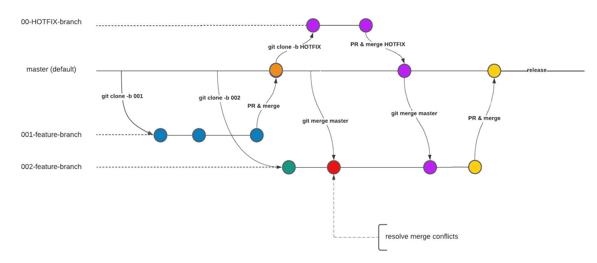
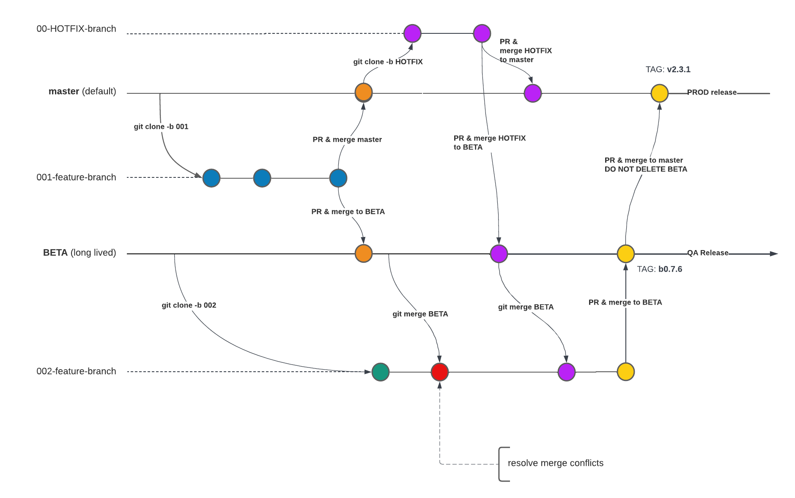

# GitFlow

&ensp;&ensp;*"This model was conceived in 2010, now more than 10 years ago, and not very long after
Git itself came into being. In those 10 years, git-flow (the branching model laid out in this article) has become hugely popular in many a software team to the point where people have started treating it like a standard of sorts — but unfortunately also as a dogma or panacea."*

\- 2020, Vincent Driessen

> `https://nvie.com/posts/a-successful-git-branching-model/` 

  
Vincent Driessen

---

## Basic GitFlow
Experience seems to indicate that every team tends to figure out a "GitFlow" facsimile that is similar but aligned for each project's own complexity and development environment.  A good place to start is just to get the basics right, and the following flow is probably the most basic form of "GitFlow" possible. This is referred to as GitHub Flow by github.

## Long Lived Branches
Most projects don't stay that simple though, and as soon as you have larger teams, with multiple environments such as PROD, QA, DEV, PRE-PROD/STAGING, TESTING etc and where product features for MOBILE, BACKEND, WEB, etc could all be at different stages of development, then the concept of `long-lived` branches becomes relevant.

It is important to keep in mind that a long-lived branch is not an excuse for not keeping your repos clean of merged branches but only applies to branches INTENTIONALLY kept alive to allow for multiple future merges to/from the long-lived branch.

> `https://quangnguyennd.medium.com/git-flow-vs-github-flow-620c922b2cbd`

It is very usefule for a team to document and update their branching strategy clearly and not to just say that they subscribe to "GitFlow", because as we have seen GitFlow tends to morph to mean different things to different people.

## Tagging
Tagging a release is used to identify a release and may also be used by the various Continuos Integration pipeline stacks to trigger an event, such as a deployment or a code/docker image build and push to container registry or binary repo, such as docker hub or nexus etc.

> [Exercise 3](./exercise-03.md) : GitFlow for team work.