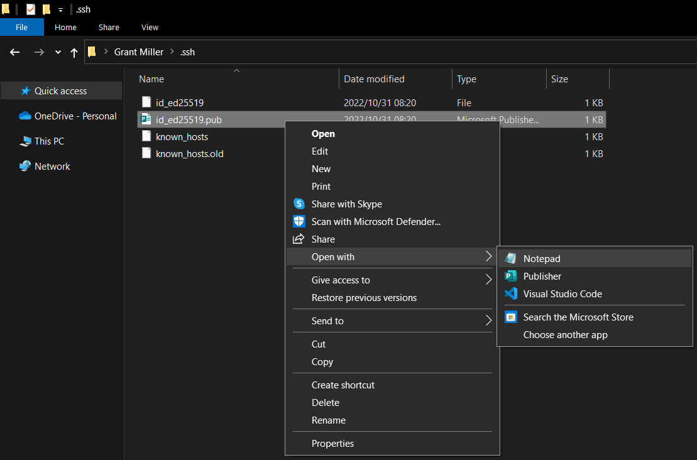
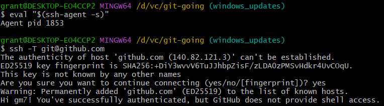

# Installing git for windows

This is a quick guide to installing git for Windows and a few troubleshooting tips are included at the end.

## Installing git for Windows
Download the latest Windows x64 installation from git scm
[Git Downloads](https://git-scm.com/download/win)

Once you have downloaded (and verified) start the setup. The following screens show the options as of version `2.38.1.windows.1`


Click Next to accept the license.
The default installation location should be fine:


Click Next to confirm your installation location. 

Use the screenshot below as a guideline:


Click Next to confirm your selection.

Select your Start Menu Folder; the default should be fine.


Click Next to confirm your selection.

It is recommended that you set the default editor to [nano](https://linuxhint.com/how-to-use-nano-in-linux/) because the commands are a lot more intuitive if you are a Windows user. For example, `CTRL+S` will save the file.


Click Next to confirm your selection.

It is recommended that you select `main` as your default branch, as this will align with GitHub's default branch naming convention.


Click Next to confirm your selection.

It is recommended that you leave this on the default setting `Git from the command line and also from 3rd-party software`


Click Next to confirm your selection.

It is recommended to use the default: `Use bundled OpenSSH`. Unless you have already configured OpenSSH in your environment.


Click Next to confirm your selection.

It is recommended to use the default: `OpenSSL library`. Unless you have requirements to use internal CA certificates.


Click Next to confirm your selection.

It is recommended to use `Checkout as-is, commit as-is` as your default option. Discuss with your team if you prefer Unix-style line endings, in which case, use one of the first two options.


Click Next to confirm your selection.

Using `MinTTY` is recommended:


Click Next to confirm your selection.

It is recommended that you leave this on the default setting:


Click Next to confirm your selection.

It is recommended that you leave this on the default setting:


Click Next to confirm your selection.

It is recommended that you leave this on the default setting:


Click Next to confirm your selection.

It is recommended no experimental features are installed. 


Click Next to start installing.


At the end of the installation, it is recommended that you launch Git Bash to start the configuration of git in Windows.

## Configuring git in Windows
If you did not already open `Git Bash` at the end of the installation above, then open `Git Bash` from your Start menu. 

Check if git is installed by running
```bash
git --version
```
For example:


Now you need to configure git in your environment. Remember to replace the `"User Name"` and `"email@domain.co.za"` with your own name and email address:
```bash
git config --global user.name "User Name"
git config --global user.email "email@domain.co.za"
git config --global color.ui auto
git config -l
```
For example:


### Generate your SSH key
It is recommended to use SSH over HTTPS as we have found it to be more stable. This section explains how to create and configure your SSH Key so that you can use SSH with GitHub.

If you do not already have `Git Bash` open, then open `Git Bash` from your Start menu.

Generate your SSH key by using the following command. Remember to replace `"your_email@example.com"` with your own email address. *DO NOT ADD A PASSPHRASE*. If you add a pass phrase you will need to enter it every time you use SSH commands in git, which will be most of the time. This will slow you down a lot.
Accept the default filename and location by pressing Enter on your keyboard.

```bash
ssh-keygen -t ed25519 -C "your_email@example.com"
```

The above command should create two files in your home SSH diretory called `id_ed25519` and `id_ed25519.pub`. This is a private and public key pair.
Check that you have the following files by running this command:
```bash
ls ~/.ssh/
```
Example output:


Next you need to add this key to your SSH agent. Run the following commands:
```bash
eval "$(ssh-agent -s)"
ssh-add ~/.ssh/id_ed25519
```

Example output: 


[Useful reference](https://docs.github.com/en/authentication/connecting-to-github-with-ssh/generating-a-new-ssh-key-and-adding-it-to-the-ssh-agent)

### Adding your SSH key to GitHub
Once you have created your SSH key and registered it with the SSH agent, you can add the public part of the key to GitHub.

Remember to keep your private key safe and never to share it. Only the public key can be shared.

[Login to Github.com](https://github.com/login)

Once you have logged in, click on the user icon on the top right of the screen and select `Settings`


Select `SSH and GPG Keys` on the left, then select `New SSH Key` which is a green button on the right of your screen.


Enter a meaningful title for your key. Typically you use the name of your machine, or the organisation that this key is connected with.

The body of the key needs to be the content of your public key file. Follow these steps to fill in the content of your public key on GitHub.com:
* Open Windows Explorer (WIN+E)
* Navigate to your home directory for SSH. For example: `c:\Users\<your windows username>\.ssh`


* Right click your public key file and open with Notepad. For example:



* Copy all of the content (CTRL+A, CTRL+C). For example:


* Switch back to Github.com and paste the content in the `Key` Field


* Click the green `Add SSH key` button in the lower left of your screen.

[Useful reference](https://docs.github.com/en/authentication/connecting-to-github-with-ssh/adding-a-new-ssh-key-to-your-github-account)

## Troubleshooting

### Test your connection to Github.com

Once you have followed the installation and configuation steps, the following should give a successful outcome:
* Open `Git Bash` (Select `Git Bash` from the Windows Start Menu)
* Check that your open ssh client is running
```bash
 eval "$(ssh-agent -s)"
```
* Test your connection to github.com
```bash
ssh -T git@github.com
```

Example:



Note that the first time you connect to a server using SSH you will be asked if you want to continue connecting. You can safely type `yes` when connecting to github.com

### Unauthenticated error
If you receive an unauthenticated error, then try to re-add your key to the ssh-agent. The instructions are above, but here is a quick guide:
```bash
eval "$(ssh-agent -s)"
ssh-add ~/.ssh/id_ed25519
ssh-add -l
```
The last command will list the ssh keys that you have added to the agent. Try o test your connection again (see above).

If you are still not able to authenticate with github.com, then check that you added the correct key to github.com. Follow the steps above to add your public key to github.com.
